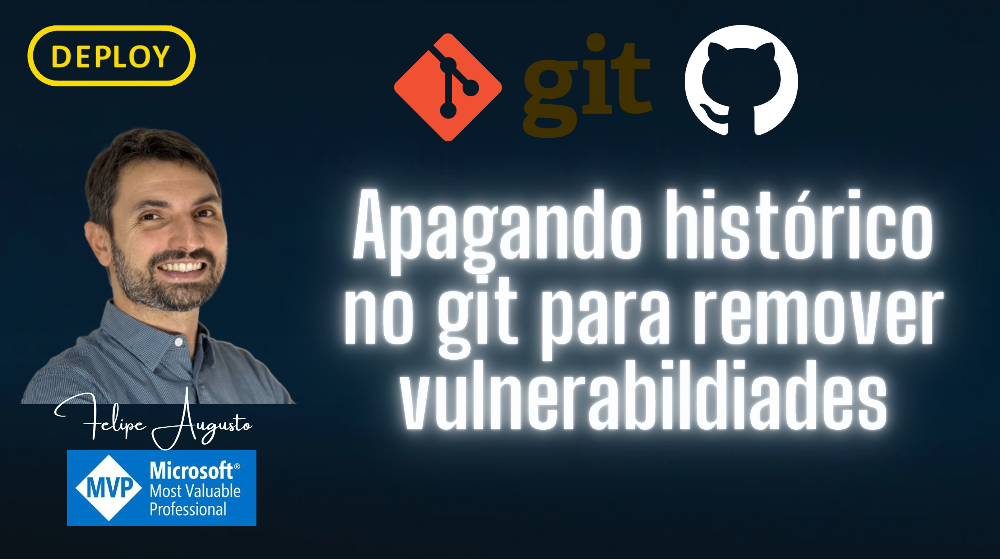

## 📖 Descrição

Este projeto é um exemplo de demonstração sobre como manipular histórico do Git, especificamente para remover segredos ou dados sensíveis que foram comitados acidentalmente, utilizando ferramentas como `git-filter-repo`.

## 📋 Pré-requisitos

Certifique-se de ter o Python instalado e a ferramenta `git-filter-repo`.

### Verificar versões do Python
```powershell
py -3.13 --version
py -3.14 --version
```

### Verificar instalação do git-filter-repo
```powershell
pip show git-filter-repo
```

## 🚀 Como Rodar

Abaixo estão os comandos de exemplo utilizados neste fluxo de trabalho.

### 1. Configurar .gitignore

Adicionar o arquivo de relatório do gitleaks (caso utilize) ao gitignore para evitar comitá-lo.

```powershell
echo ".gitleaks" >> .gitignore
```

### 2. Gerenciamento de Tags

Criar tags para simular versões (ex: uma versão com bug/vazamento).

```powershell
# Lista as tags existentes
git tag

# Criar uma tag anotada
git tag -a v.1.2.5 -m "feat: tag with bug"

# Enviar a tag para o remoto
git push origin v.1.2.5

# Deletar uma tag local e remotamente (ex: v2)
git tag -d v2
git push --delete origin v2
```

### 3. Preparar Arquivo de Substituição

Criar um arquivo `replace.txt` definindo o que deve ser substituído. O formato é `texto_original==>texto_novo`.

```powershell
"texto_original==>**REMOVED**" | Out-File replace.txt -Encoding utf8
```

### 4. Analisar o Repositório (Opcional)

Gera relatórios sobre o histórico do repositório, úteis para verificar o que será alterado ou para auditoria.

```powershell
git filter-repo --analyze
```

### 5. Executar a Limpeza (Exemplo)

> **Nota:** Certifique-se de ter um backup do repositório antes de rodar comandos que reescrevem o histórico.

Para aplicar a substituição usando o `git-filter-repo`:

```powershell
git filter-repo --replace-text replace.txt
```

### 6. Atualizar o Repositório Remoto

Após reescrever o histórico, é necessário forçar o push para o remoto.

```powershell
# Adicionar o remoto (se necessário)
git remote add origin https://github.com/felipementel/DEPLOY.GitFilterRepo.GitLeaks.git

# Forçar a atualização de todas as branches e tags
git push --force --all
git push --force --tags
```

### 7. Recriar o Histórico (orphan) e atualizar a main

Caso precise iniciar um histórico limpo a partir do estado atual dos arquivos:

```powershell
git checkout --orphan temp
git add .
git commit -m "Initial commit"
git branch -D main
git branch -m main
git push -f origin main
```

### 8. O que quem já tem o repositório precisa fazer

Se o histórico foi reescrito, quem já clonou o repositório precisa sincronizar o histórico local com o remoto:

```powershell
git fetch
git checkout main
git reset --hard origin/main
```

### 9. Explicação do set-upstream

Se a branch local `main` perder o vínculo com a branch remota, use:

```powershell
git branch --set-upstream-to=origin/main main
```

Esse comando define que a `main` local deve acompanhar (`track`) a `origin/main`. Isso é útil após reescrever o histórico ou recriar branches, garantindo que `git pull` e `git push` saibam qual branch remota usar por padrão.
